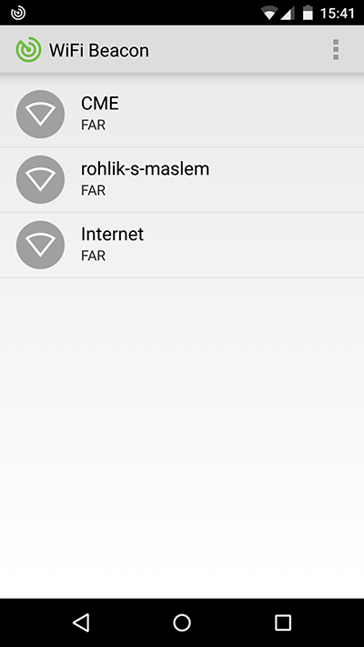

WiFiBeacon demo app for Android
==========================

App demonstrating usage of WiFi APs in iBeacon fashion. Read more at [droidboy.cz](http://www.droidboy.cz/2015/03/wifi-beacon.html)

WiFiBeacon demo app
-----

Download it from [Google Play](https://play.google.com/store/apps/details?id=cz.droidboy.wifibeacondemo)

Usage - core classes
-----

ProximityMonitor - used for monitoring device's presence in a defined region by a ScanFilter.
You can listen for following callbacks:
* onEnterRegion
* onDwellRegion
* onExitRegion

ProximityScanner - used for fast updates of device's surroundings counstrained by a ScanFilter.
Results are delivered to callback:
* onAPsDiscovered

License
-------

    Copyright 2015 Jonáš Ševčík

    Licensed under the Apache License, Version 2.0 (the "License");
    you may not use this file except in compliance with the License.
    You may obtain a copy of the License at

       http://www.apache.org/licenses/LICENSE-2.0

    Unless required by applicable law or agreed to in writing, software
    distributed under the License is distributed on an "AS IS" BASIS,
    WITHOUT WARRANTIES OR CONDITIONS OF ANY KIND, either express or implied.
    See the License for the specific language governing permissions and
    limitations under the License.